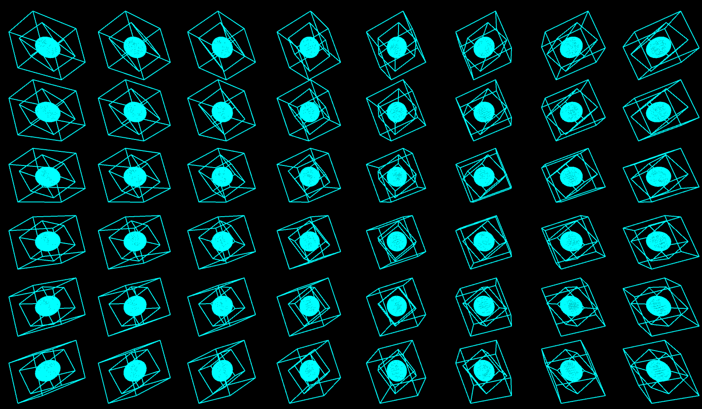
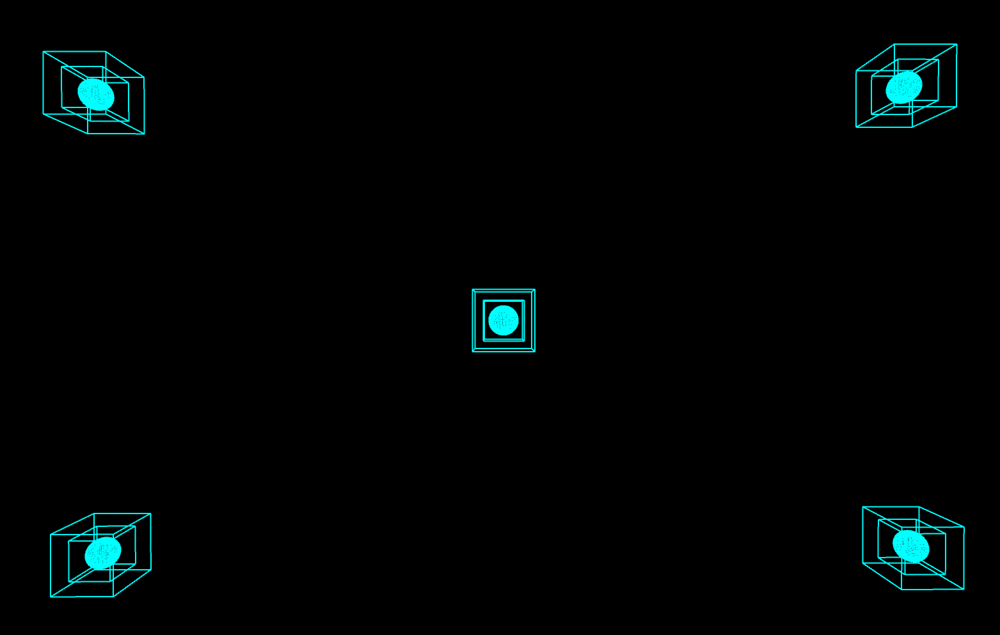
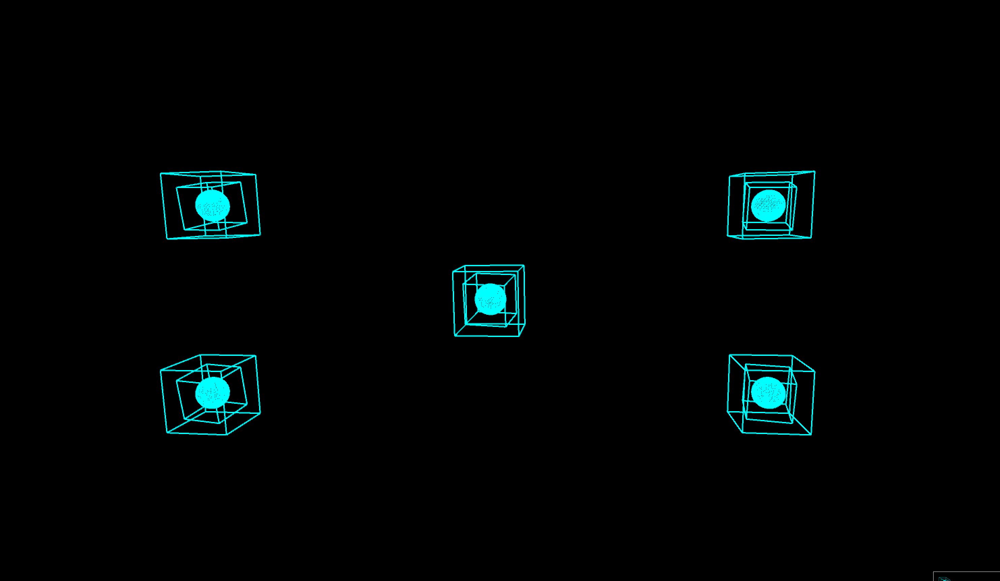
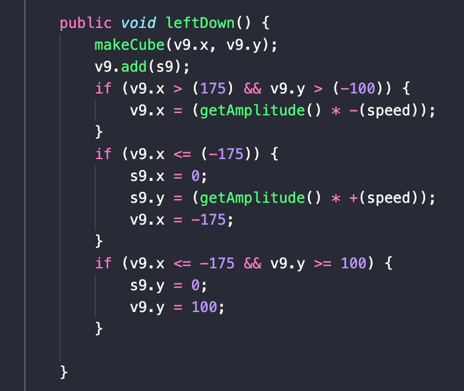

# Music Visualiser Project

Name: Givago Teixeira Guimaraes

Student Number: D19124603

Video: [Video](https://youtu.be/GmTVj-t-xfI)

# Description of the assignment

This assignment is an cool animation of 3d squares that are drawn in the screen and that are spinning around themself they also have another squared drawn inside them and one sphere that moves and grows based on the music's frequencies and amplitude.

The main point of this assigment is to make a visual interaction with the elements given and try to change the screens by youself and make it visually atractive for the person who is changing the screens and the process.

# Instructions

When compiling the program, press the Start button the start the music and the animation will start.
The animation will start at the step 3 and you will have to press the button 1 to change to step 1 and press press 2 to change to step 2.

# How it works

When the animation starts it will start at the page 3 that will show 48 cubes moving based on the music frequencies and amplitude.

Pressing Key 3:


Pressing Key 1:


Pressing Key 2:


# What I am most proud of in the assignment

The possiblity of changing direction of the cubes based on there position and based on where they moved to. creating multiple cubes and making all of them to be responsive based on the music or microphone audio.


# Markdown Tutorial

This is _emphasis_

This is a bulleted list

- Item
- Item

This is a numbered list

1. Item
1. Item

This is a [hyperlink](http://bryanduggan.org)

# Headings

## Headings

#### Headings

##### Headings

This is code:

```Java
public void render()
{
	ui.noFill();
	ui.stroke(255);
	ui.rect(x, y, width, height);
	ui.textAlign(PApplet.CENTER, PApplet.CENTER);
	ui.text(text, x + width * 0.5f, y + height * 0.5f);
}
```

So is this without specifying the language:

```
public void render()
{
	ui.noFill();
	ui.stroke(255);
	ui.rect(x, y, width, height);
	ui.textAlign(PApplet.CENTER, PApplet.CENTER);
	ui.text(text, x + width * 0.5f, y + height * 0.5f);
}
```

This is an image using a relative URL:


This is an image using an absolute URL:


This is a youtube video:

[](https://www.youtube.com/watch?v=J2kHSSFA4NU)

This is a table:

| Heading 1  | Heading 2                      |
| ---------- | ------------------------------ |
| Some stuff | Some more stuff in this column |
| Some stuff | Some more stuff in this column |
| Some stuff | Some more stuff in this column |
| Some stuff | Some more stuff in this column |
